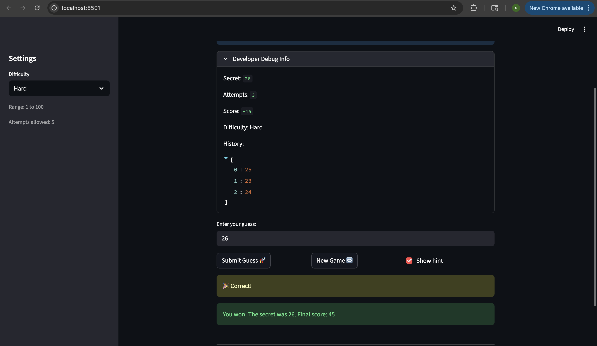

# 🎮 Game Glitch Investigator: The Impossible Guesser

## 🚨 The Situation

You asked an AI to build a simple "Number Guessing Game" using Streamlit.
It wrote the code, ran away, and now the game is unplayable. 

- You can't win.
- The hints lie to you.
- The secret number seems to have commitment issues.

## 🛠️ Setup

1. Install dependencies: `pip install -r requirements.txt`
2. Run the broken app: `python -m streamlit run app.py`

## 🕵️‍♂️ Your Mission

1. **Play the game.** Open the "Developer Debug Info" tab in the app to see the secret number. Try to win.
2. **Find the State Bug.** Why does the secret number change every time you click "Submit"? Ask ChatGPT: *"How do I keep a variable from resetting in Streamlit when I click a button?"*
3. **Fix the Logic.** The hints ("Higher/Lower") are wrong. Fix them.
4. **Refactor & Test.** - Move the logic into `logic_utils.py`.
   - Run `pytest` in your terminal.
   - Keep fixing until all tests pass!

## 📝 Document Your Experience

- [ ] Describe the game's purpose.
Answer: Game Glitch Investigator is a number guessing game where the player tries to guess the randomly generated secret number within a limited number of attempts. Game has 3 difficulties easy, normal and hard. each have different range and attempts.
- [ ] Detail which bugs you found.
Answer: Hard difficulty had a smaller range (1-50) than Normal (1-100), making it easier than Normal
Hint messages were swapped — "Go Higher" showed when you should go lower, and vice versa
Attempts counter was initialized to 1 instead of 0, causing an off-by-one error
Win score formula used attempt_number + 1, penalizing the player an extra 10 points unfairly
Wrong guesses on even-numbered attempts rewarded +5 points instead of deducting
New game button didn't reset status or history, so the game stayed locked after a win/loss
New game button used a hardcoded range of 1-100 instead of respecting the selected difficulty
Info message hardcoded "1 and 100" regardless of difficulty
Secret was converted to a string on even attempts, causing incorrect string-based comparisons
Empty or invalid guesses still counted as an attempt

- [ ] Explain what fixes you applied.
Answer: Changed Hard range to 1-100 to match Normal
Swapped the hint messages so "Go Lower" and "Go Higher" are correct
Changed attempts initialization from 1 to 0
Removed the + 1 from the win score formula
Removed the even-attempt bonus — wrong guesses always deduct 5 points now
Added st.session_state.status = "playing" and st.session_state.history = [] to the new game block
Changed random.randint(1, 100) to random.randint(low, high) in the new game block
Replaced hardcoded "1 and 100" with {low} and {high} in the info message
Removed the even/odd attempt secret type conversion — secret is always kept as an integer
Moved st.session_state.attempts += 1 inside the valid guess block so invalid inputs don't cost an attempt

## 📸 Demo

- [ ] [Insert a screenshot of your fixed, winning game here]

## 🚀 Stretch Features

- [ ] [If you choose to complete Challenge 4, insert a screenshot of your Enhanced Game UI here]
